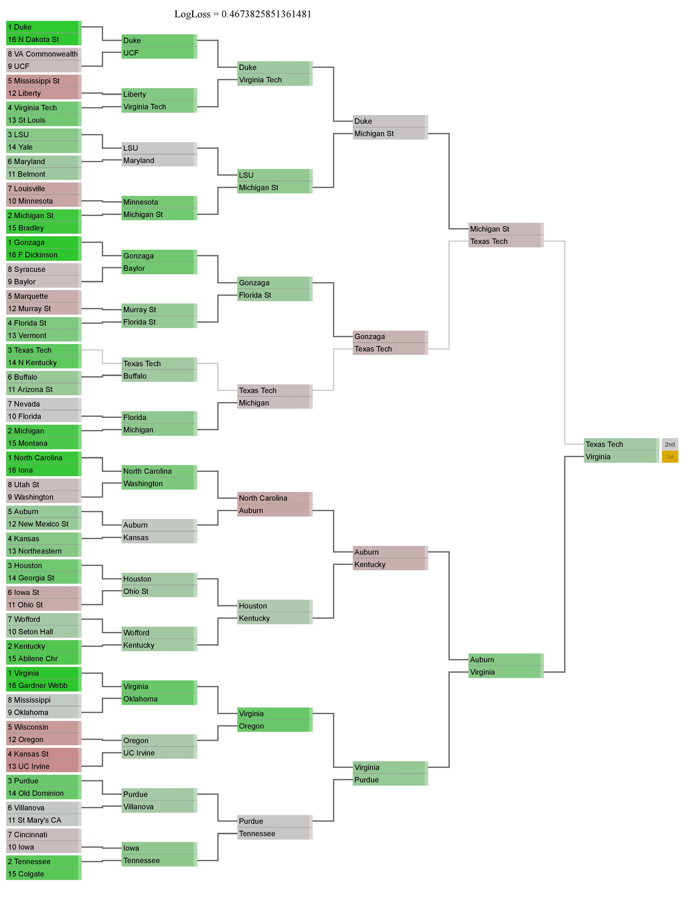

# 2019_NCAA_Tournament_Predictor
A model created for the 2019 Kaggle March Madness Competition.  Data was modeled using a logistic regression and Ken Pomeroy end of season ratings.  In an attempt to encorage predicting upsets, the model was fit on the data excluding Team Seeds as well as Team Rankings.

To run from the command line:  

With all files in the same directory type:
```
python3 FinalPredictions.py 'TrainFileloc.csv' 'ValidationFileloc.csv'
```

### Tournament prediction results

